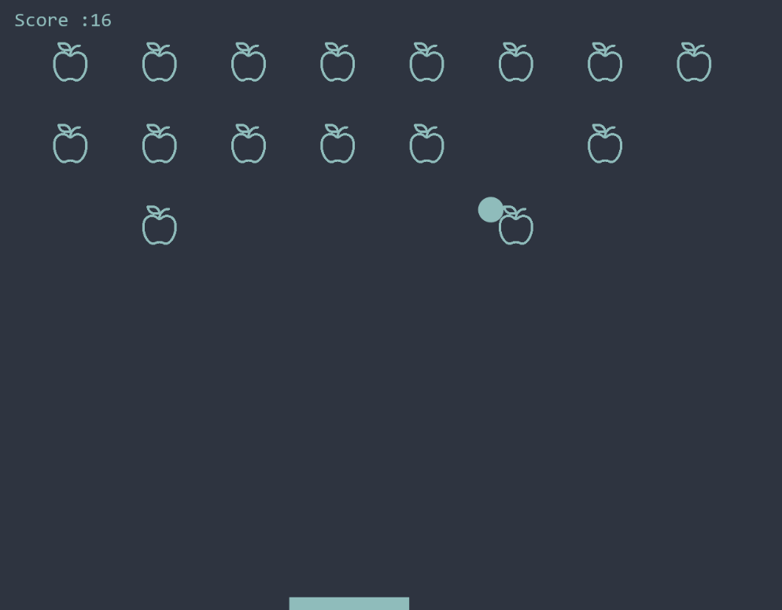
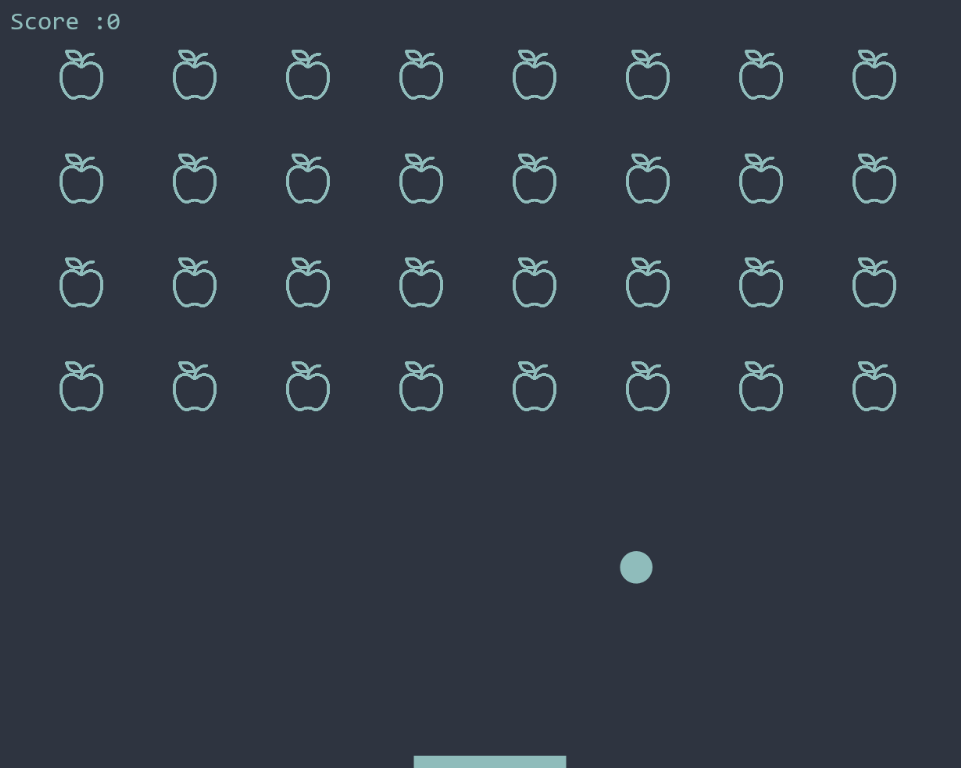

#block-breaker-arcade-game
Simple Arkanoid type game with javascript and HTML5 Canvas

Game logic:
----------
The Player must clear a formation of colorful blocks by deflecting a ball towards it without letting the ball leave the bottom edge of the playfield.

To-do:
----------
- Levels: have more levels with difficulty rising with each level up.  
- Colours: change the ball colour so it has to hit the blocks with same colour to clear them
- PowerUp: figure out some powerups, maybe more health or invincibility for a short period of time.  
